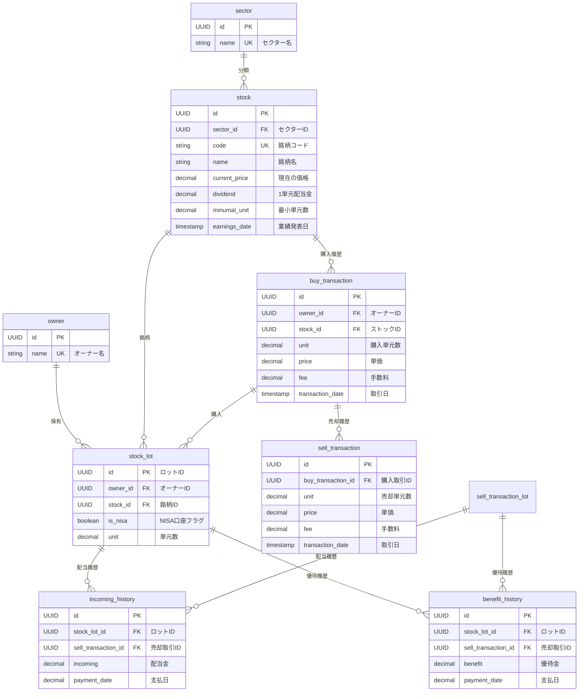

### **ロット識別の必要性**
日本の株式市場では100株が最小単元であるため、200株購入時はstock.minumal_unit(=100) * stock_lot.unit(=2)を設定します 。
各ロットは独立した取得時期を持つため、**ロット別の識別管理**が不可欠です 。
ロットの一部の単元を売却した場合はロット数を減少させます。

### **配当金の個別紐づけ**
配当金を受け取った際は配当履歴レコードを1単元ごとに作成し、各配当履歴レコードにロットIDと紐づけます。
ロット数が減少した場合は、stock_lot_idに紐づく配当履歴のレコードをすべて探し出し、減少したsell_transactionレコードのIDを配当履歴レコードにつける。そしてstock_lot_idを削除する。

### **優待金の個別紐づけ**
配当金(incoming_history)と同じ仕様とします。

## ER図（ロット別管理対応）

