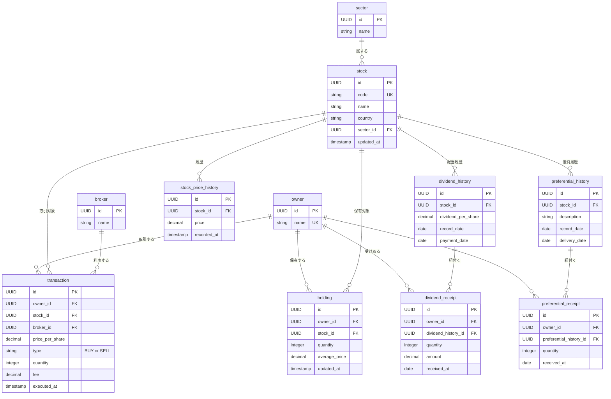

## 改訂版ER図（mermaid構文）

```mermaid
erDiagram
    owner {
        UUID id PK
        string name UK
    }

    sector {
        UUID id PK
        string name
    }

    broker {
        UUID id PK
        string name
    }

    stock {
        UUID id PK
        string code UK
        string name
        string country
        UUID sector_id FK
        timestamp updated_at
    }

    stock_price_history {
        UUID id PK
        UUID stock_id FK
        decimal price
        timestamp recorded_at
    }

    dividend_history {
        UUID id PK
        UUID stock_id FK
        decimal dividend_per_share
        date record_date
        date payment_date
    }

    preferential_history {
        UUID id PK
        UUID stock_id FK
        string description
        date record_date
        date delivery_date
    }

    transaction {
        UUID id PK
        UUID owner_id FK
        UUID stock_id FK
        UUID broker_id FK
        decimal price_per_share
        string type "BUY or SELL"
        integer quantity
        decimal fee
        timestamp executed_at
    }

    dividend_receipt {
        UUID id PK
        UUID owner_id FK
        UUID dividend_history_id FK
        integer quantity
        decimal amount
        date received_at
    }

    preferential_receipt {
        UUID id PK
        UUID owner_id FK
        UUID preferential_history_id FK
        integer quantity
        date received_at
    }

    holding {
        UUID id PK
        UUID owner_id FK
        UUID stock_id FK
        integer quantity
        decimal average_price
        timestamp updated_at
    }

    owner ||--o{ holding : "保有する"
    owner ||--o{ transaction : "取引する"
    owner ||--o{ dividend_receipt : "受け取る"
    owner ||--o{ preferential_receipt : "受け取る"
    stock ||--o{ transaction : "取引対象"
    stock ||--o{ holding : "保有対象"
    stock ||--o{ stock_price_history : "履歴"
    stock ||--o{ dividend_history : "配当履歴"
    stock ||--o{ preferential_history : "優待履歴"
    sector ||--o{ stock : "属する"
    broker ||--o{ transaction : "利用する"
    dividend_history ||--o{ dividend_receipt : "紐付く"
    preferential_history ||--o{ preferential_receipt : "紐付く"
```
