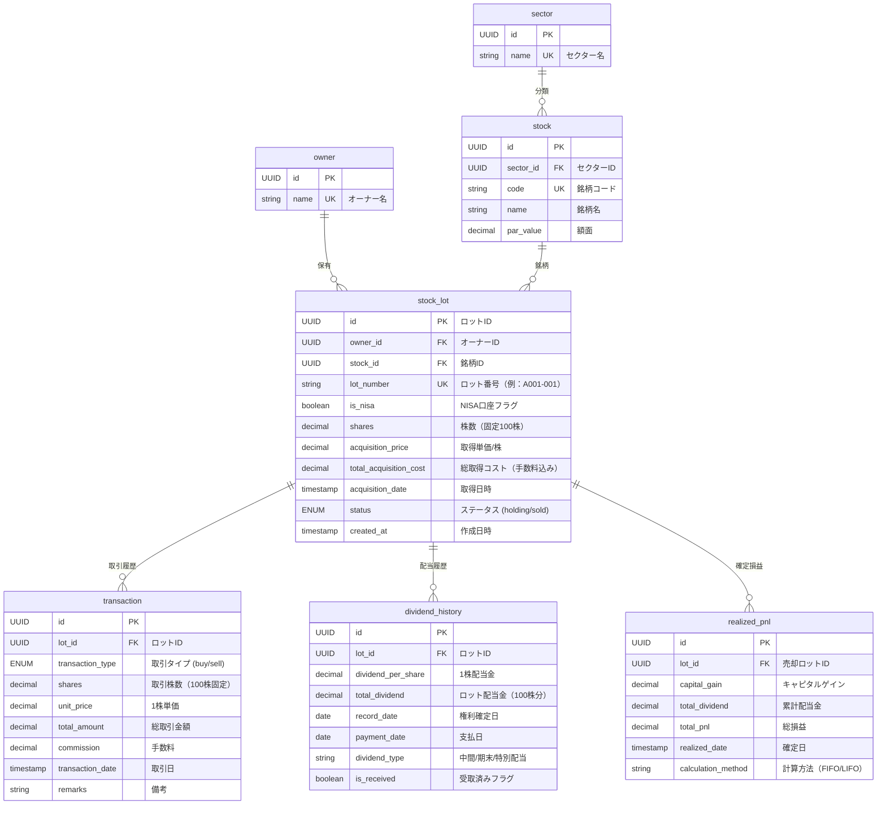

## 100株ロット別管理システムの必要性

まさにその通りです。**各100株ロットに個別のindex番号を付与**し、配当金を各ロットに紐づけて管理する必要があります。これにより、部分売却時の**FIFO（先入先出）**や**LIFO（後入先出）**戦略を正確に実行できます 。[1][2]

## ロット別管理の重要性

### **ロット識別の必要性**
日本の株式市場では100株が最小単元であるため、200株購入時は自動的に2つの100株ロットに分割されます 。各ロットは独立した取得時期、価格、配当履歴を持つため、**ロット別の識別管理**が不可欠です 。[3][4][5][6]

### **配当金の個別紐づけ**
配当金は各ロットの保有期間と株数に応じて個別に計算されるため、ロット単位での配当履歴管理により正確な損益計算が可能になります 。[7][8]

## 修正版ER図（ロット別管理対応）



## 主要な設計変更点

### **1. stock_lotテーブルの新設**
- 各100株を独立したロットとして管理
- `lot_number`で一意識別（例：A001-001, A001-002）
- 各ロットの取得価格と日時を個別保存[5][9]

### **2. ロット単位での配当管理**
```sql
-- 銘柄A 200株購入時のロット作成例
INSERT INTO stock_lot VALUES 
('lot1', 'owner1', 'stockA', 'A001-001', false, 100, 1000, 100000, '2024-01-15'),
('lot2', 'owner1', 'stockA', 'A001-002', false, 100, 1000, 100000, '2024-01-15');

-- 各ロットへの配当金登録
INSERT INTO dividend_history VALUES
('div1', 'lot1', 10, 1000, '2024-03-31', '2024-06-30', '期末配当', true),
('div2', 'lot2', 10, 1000, '2024-03-31', '2024-06-30', '期末配当', true);
```

### **3. 売却時のロット指定**
売却時は特定のロットを指定し、FIFO/LIFO戦略を実装：
```sql
-- FIFO売却：最古のロット（lot1）を売却
UPDATE stock_lot SET status = 'sold' WHERE id = 'lot1';
INSERT INTO realized_pnl VALUES ('pnl1', 'lot1', 10000, 1000, 11000, NOW(), 'FIFO');
```

### **4. 損益計算の精密化**
- **確定損益**: 売却されたロットの個別計算
- **含み損益**: 保有中ロットの現在株価との差額
- **配当収益**: 各ロットの配当履歴合計[2][6]

## 実装上の利点

### **トレーサビリティの確保**
各100株ロットの「いつ、いくらで購入し、どれだけ配当を受け取ったか」を完全に追跡できます 。[9][8]

### **柔軟な売却戦略**
FIFO、LIFO、指定ロット売却等の戦略をロット単位で実行可能です 。[1][2]

### **税務対応の簡素化**
各ロットの取得価額と売却損益が明確に分離され、確定申告時の計算が正確になります 。[10][11]

この設計により、200株購入時に自動的に2つの独立した100株ロット（index:1, index:2）が作成され、各ロットに配当金が個別に紐づけられて管理されます 。[6][5]
