### **ロット識別の必要性**
日本の株式市場では100株が最小単元であるため、200株購入時はstock.minumal_unit(=100) * stock_lot.unit(=2)を設定します 。
各ロットは独立した取得時期、価格、配当履歴を持つため、**ロット別の識別管理**が不可欠です 。

### **配当金の個別紐づけ**
配当金は各ロットの保有期間と株数に応じて個別に計算されるため、ロット単位での配当履歴管理により正確な損益計算が可能になります 。

ロットの一部の単元を売却した場合は売却済みロットとして別のロットデータに複製します。また配当金履歴(incoming_history)もその時点のデータを複製し、新しいロットに割り当てて配当金を確定させます。

## ER図（ロット別管理対応）

```mermaid
erDiagram
    stock {
        UUID id PK
        UUID sector_id FK "セクターID"
        string code UK "銘柄コード"
        string name "銘柄名"
        decimal current_price "現在の価格"
        decimal dividend "1単元配当金"
        decimal minumal_unit "最小単元数"
        timestamp earnings_date "業績発表日"
    }
    
    stock_lot {
        UUID id PK "ロットID"
        UUID owner_id FK "オーナーID"
        UUID stock_id FK "銘柄ID" 
        boolean is_nisa "NISA口座フラグ"
        decimal unit "単元数"
        ENUM status "ステータス (holding/sold)"
    }
    
    transaction {
        UUID id PK
        UUID lot_id FK "ロットID"
        ENUM type "buy or sell"
        decimal price "単価"
        decimal tax "手数料"
        timestamp transaction_date "取引日"
    }

    incoming_history {
        UUID id PK
        UUID lot_id FK "ロットID"
        decimal incoming "配当金"
    }

    benefit_history {
        UUID id PK
        UUID lot_id FK "ロットID"
        decimal benefit "優待金"
    }

    owner {
        UUID id PK
        string name UK "オーナー名"
    }
    

    sector {
        UUID id PK
        string name UK "セクター名"
    }
    
    owner ||--o{ stock_lot : "保有"
    stock ||--o{ stock_lot : "銘柄"
    stock_lot ||--o{ transaction : "取引履歴"
    stock_lot ||--o{ incoming_history : "配当履歴"
    stock_lot ||--o{ benefit_history : "優待履歴"
    sector ||--o{ stock : "分類"
```

